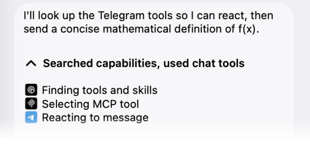

# 𝒕𝒈(𝒇x)

Chat with a Vercel [𝒇x](https://github.com/vercel-labs/fx) coding agent from
Telegram. Works with your locally installed 𝒇x, and provides as much latest Telegram features as possible.

## Features

- [x] Rich replies: markdown, tables, code blocks, spoilers, TeX math
- [x] Live streaming while the agent works, renders tool calls nicely
- [x] Four output modes, from a quiet answer to a live status line or the full tool log
- [x] Can work in DMs and groups
- [x] Can send stickers and send reactions
- [x] Interactive model picker (`/model`)
- [x] Conversation compaction (`/compact`) and fresh starts (`/clear`)
- [x] Cost reports (`/cost`)
- [x] Approval cards for destructive actions
- [x] Bots can be group admins: pin messages, moderate, and more
- [x] Custom emoji icons for tool calls and popular MCPs ([see below](#custom-icons))
- [x] Agent can see attached file, images, **voice messages** and even **video messages**!

## Install

You need [Bun 1.4+](https://bun.sh), an authenticated `fx 0.0.8+`, and a bot
token from [@BotFather](https://t.me/BotFather).

Why we depend on Bun? We use it to keep everything minimal and fast,
reusing as much of Bun's built-ins as possible (SQLite, image compression etc.).

Pre-built binaries are coming soon: a self-contained executable that runs
without Bun, in case you don't want to install it.

```bash
# 1. Install the package
bun add --global @molefrog/tgfx

# 2. Grab a bot token from @BotFather, then run tgfx in your project folder.
#    It walks you through authorization on the first run.
cd my-project
tgfx
```

## How it works

That's it. `tgfx` starts an `fx acp` process in that folder, with your current
𝒇x provider and model, and bridges it to your Telegram bot. Pass `--yolo` to
skip 𝒇x's permission checks.

On the first run it asks for your bot token and pairs you as the owner: scan a
QR code or tap a link. To change or remove the token later, run `tgfx auth`.
Everything tgfx remembers about a folder lives under `~/.fx/telegram/`; nothing
is written into the project.

## Output modes

Pick how answers reach Telegram with `--output <mode>` for one run, or press
`f` in the running terminal to switch for the next turn and save the choice
for this project:

```text
answer     one message with just the answer
report     one message: the answer, then what fx did (collapsed)
progress   a live status line ("Reading files…"), then the answer streams in
live       a live draft with every tool call as it happens (default)
```

Groups always get one message. Set a machine-wide default in
`~/.fx/telegram/config.json`:

```json
{ "defaults": { "output": "progress" } }
```

## MCP

𝒇x doesn't inherit MCP servers from your config automatically in ACP mode that Telegram channel uses.
We're working on adding this soon! 

## Custom icons



The bot renders tool calls nicely with the
[tgfx icons](https://t.me/addemoji/ai_provider_labs_by_fxharness_bot) premium custom
emoji pack: every 𝒇x tool gets its own icon, and so do 100+ popular MCP
servers (GitHub, Notion, Slack, Figma, and friends). The model picker uses
provider logos (OpenAI, Anthropic, etc.) from the same pack.

To turn it off, start with `tgfx --no-icons`.

## Commands

```text
tgfx           run fx in this folder (sets up on first run)
tgfx --yolo    same, without fx permission checks
tgfx --output  answer · report · progress · live
tgfx allow     let more users or chats talk to the bot (no id: pair by QR code)
tgfx auth      add, rotate, or remove the bot token
tgfx doctor    diagnostics: token, chats, rights, fx
```

Details, guarantees, and the rest of the commands live in the
[specification](./doc/SPEC.md).
