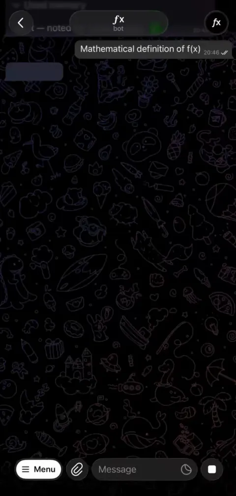
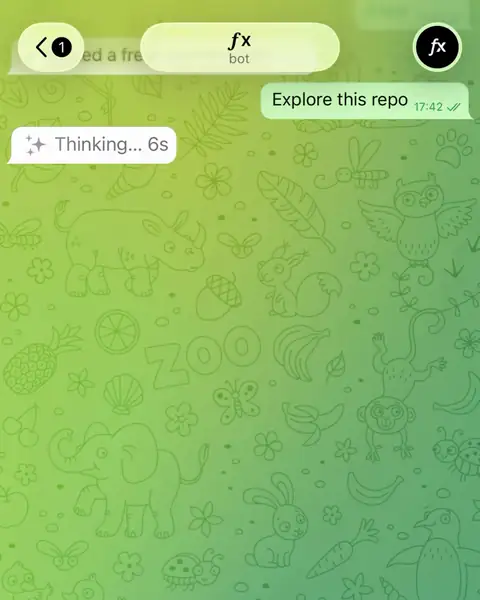
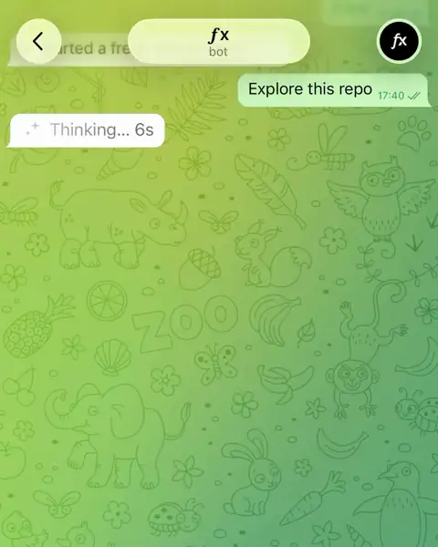
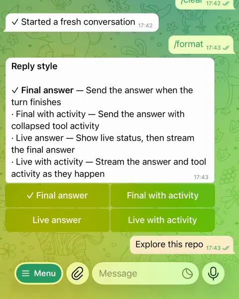

# 𝒕𝒈(𝒇x)

Chat with a Vercel [𝒇x](https://github.com/vercel-labs/fx) coding agent from
Telegram. Works with your locally installed 𝒇x and supports as many of the latest Telegram features as possible.

## Features



Most Telegram adapters for popular harnesses only scratch the surface of what Telegram can do.
Not 𝒕𝒈(𝒇x): the aim is chatting with your agent from Telegram the way you would from its TUI.

- [x] Rich replies: markdown, tables, code blocks, spoilers, TeX math
- [x] Live streaming while the agent works, renders tool calls nicely
- [x] Four reply styles (`/format`), from a quiet final answer to a live draft with tool activity
- [x] Can work in DMs and groups
- [x] Can send stickers and reactions
- [x] Interactive model picker (`/model`)
- [x] Conversation compaction (`/compact`) and fresh starts (`/clear`)
- [x] Cost reports (`/cost`)
- [x] Approval cards for destructive actions
- [x] Bots can be group admins: pin messages, moderate, and more
- [x] Custom emoji icons for tool calls and popular MCPs ([see below](#custom-icons))
- [x] The agent can see attached files, images, **voice messages** and even **video messages**!
- [x] Location pins and venue details
- [x] Forwarded messages arriving together get one response, with their original sources preserved
- [x] Send photos, voice messages, and circular video messages
- [ ] `soon` Talking to [other bots](https://telegram.org/blog/ai-bot-revolution-11-new-features#bot-to-bot-communication)

## Install

You need [Bun 1.4+](https://bun.sh), an authenticated `fx 0.0.8+`, and a bot
token from [@BotFather](https://t.me/BotFather).

Why we depend on Bun? We use it to keep everything minimal and fast,
reusing as much of Bun's built-ins as possible (SQLite, image compression etc.).

```bash
# 1. Install the package
bun add --global @molefrog/tgfx

# 2. Grab a bot token from @BotFather, then run tgfx in your project folder.
#    It walks you through authorization on the first run.
tgfx
```

## How it works

That's it. `tgfx` starts an `fx acp` process in that folder, with your current
𝒇x provider and model, and bridges it to your Telegram bot. Pass `--yolo` to
skip 𝒇x's permission checks.

On the first run it asks for your bot token and pairs you as the owner: scan a
QR code or tap a link. To change or remove the token later, run `tgfx auth`.
Everything tgfx remembers about a folder lives under `~/.fx/telegram/`; nothing
is written into the project.

## Reply style

𝒕𝒈(𝒇x) has four reply styles, depending on whether you want the answer
streamed and whether you want to see the full history of tool calls.

By default, it streams the text using Telegram's new
[live message drafts](https://telegram.org/blog/ai-bot-revolution-11-new-features#streaming-text-for-bots).
Tool calls are rendered as collapsible groups, in the order they happen.

<table>
  <tr>
    <th align="center">Live with activity</th>
    <th align="center">Live answer</th>
    <th align="center">No streaming</th>
  </tr>
  <tr>
    <td width="240" align="center"></td>
    <td width="240" align="center"></td>
    <td width="240" align="center"></td>
  </tr>
  <tr>
    <td align="center"><code>live</code> (default)<br>Stream the answer and tool activity as they happen</td>
    <td align="center"><code>progress</code><br>Show live status drafts, then stream the final answer</td>
    <td align="center"><code>answer</code><br>Send the answer only when the full turn finishes</td>
  </tr>
</table>

There is also **Final with activity** (`report`): the final answer with the
tool activity collapsed underneath it. Groups always get one message.

How to pick a reply style:

- Start 𝒕𝒈(𝒇x) with `--output <mode>` for one run
- Press <kbd>f</kbd> in the running terminal, or send `/format` to the bot and tap a button
- Set a machine-wide default in `~/.fx/telegram/config.json`:

```json
{ "defaults": { "output": "progress" } }
```

## Custom icons


The bot renders tool calls nicely with the
[tgfx icons](https://t.me/addemoji/ai_provider_labs_by_fxharness_bot) premium custom
emoji pack: every 𝒇x tool gets its own icon, and so do 100+ popular MCP
servers (GitHub, Notion, Slack, Figma, and friends). The model picker uses
provider logos (OpenAI, Anthropic, etc.) from the same pack.

To turn it off, start with `tgfx --no-icons`.

## MCP

𝒇x doesn't inherit MCP servers from your config automatically in ACP mode that Telegram channel uses.
We're working on adding this soon! 

## Commands

```text
tgfx           run fx in this folder (sets up on first run)
tgfx --yolo    same, without fx permission checks
tgfx --output  answer · report · progress · live
tgfx allow     let more users or chats talk to the bot (no id: pair by QR code)
tgfx auth      add, rotate, or remove the bot token
tgfx doctor    diagnostics: token, chats, rights, fx
```

Details, guarantees, and the rest of the commands live in the
[specification](./doc/SPEC.md).
